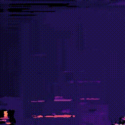
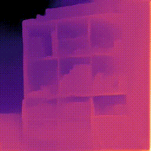
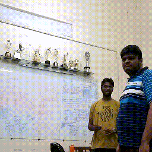
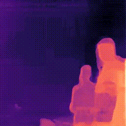

# Depth-Estimation  


# Table of contents
- [Aim](#Aim)
- [About the Project](#About-The-Project)
- [Getting Started](#Getting-Started)
- [Prerequisites and Installations](#Prerequisites-And-Installations)
- [Methodologies Proposed](#Methodologies-Proposed)
  - [Proposal 1 : Using Processing Techniques](#Proposal-1--Implementing-Pre--Post-Processing)
  - [Proposal 2 : Using MDE](#Proposal-2--Applying-Midas-Model-On-RGB-Video--MDE-)
  - [Proposal 3 : Fusion Of Stereo And MDE](#Proposal-3--Fusing-Stereo-Disparity-Map-and-MDE-Disparity-Map)
-  [Results](#Results)
-  [License](#License)

## Aim


To improve depth estimation and disparity map generation using OAK-D Pro camera. To justify a method to get highly accurate depth map by utilizing traditional knowledge and modern deep learning techniques.

## About The Project

Depth estimation is traditionally done using a pair of cameras called a stereo pair. 
Depth Estimation algorithms using Neural Networks have made enormous strides recently. Some algorithms estimate depth using a single image (monocular depth), others use neural networks to improve the depth estimated using a stereo pair, and some improve the depth estimation for RGBD cameras.
| Original Image | Disparity Map
|-----|-----|
|||

## Getting Started


## Prerequisites And Installations

1. Install Depthai and many other important librariesutilized in this project by running following command :
```
    pip install -r requirements.txt
```
2. You must have an OAK-D camera
3. Required weights and models for code can be installed from [scripts](scripts) 

## Methodologies Proposed


### Proposal 1 : Implementing Pre + Post Processing

While going through various research paper we found that performing pre processing on stereo left and stereo right image and then implementing stereo rectification as well as triangulation method increases depth perception of camera manifolds. As well as reduce its noise.Preprocessing on images with certain touch on it with inbuilt OAK D post processing  filters has improved its depth a lot.
For Example , 
|Stereo Map Generated By OAK-D|Stereo Map After Pre+Post Processing|
|--------|---------|
||

#### Demo
1. Download prerequisite files from [scripts](scripts) and then perform following steps.
2. Run following command on terminal
```
    python3 Processing.py
```
### Proposal 2 : Applying Midas Model On RGB Video [MDE]


MiDAS is a pretrained model which improves Monocular Depth Estimation (MDE) of monocular RGB video. It generates a state of the art image.
The success of monocular depth estimation relies on large and diverse training sets. Due to the challenges associated with acquiring dense ground-truth depth across different environments at scale, a number of datasets with distinct characteristics and biases have emerged.
MiDaS was trained on 10 datasets (ReDWeb, DIML, Movies, MegaDepth, WSVD, TartanAir, HRWSI, ApolloScape, BlendedMVS, IRS) with multi-objective optimization.

| Normal RGB Image | MiDAS MDE |
|-------|---------|
|  |  |

#### Demo
1. Download prerequisite files from the [scripts](scripts) and perform following step.
2. Run following command on terminal
```
    python3 Midas.py
```

### Proposal 3 : Fusing Stereo Disparity Map and MDE Disparity Map


In this approach we fuse disparity map generated by OAK-D using stereo cameras and disparity map generated using MiDAS model (MDE) on rgb video. This method aims to combine excellent features of Stereo as well as Monocular Depth Estimations and reduce noise generated by one disparity map by superimposing quality of other disparity map.
For further information kindly check folder [Fusion](Fusion)

| Original Scene | Steeo Disparity By OAK-D | MiDAS Disparity | Fused Disparity Map |
|--------|--------|--------|--------|
|||||

#### Demo
1. Download prerequisite files from [scripts](scripts) and then perform following steps.
2. Run following command on terminal
```
    python3 main.py
```

### Results


| Original Scene | OAK-D Stereo | MiDAS MDE | Fusion |
|-----|-----|-----|-----|
|||||
|||||
|||||
|||||

Following is the final result of our methodology with its real time analysis in Frames Per Second (FPS)

| Methods | FPS |
|-----------|----------|
| Pre+ post processing on Stereo | 25 |
| Only MiDAS | 18 |
| Fusion Using CMAP From OAK - D | 15 |
| Fusion Using canny edge on RGB | 13|

### License


[MIT License]() is added to project. 
